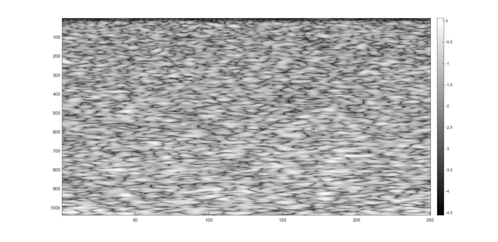
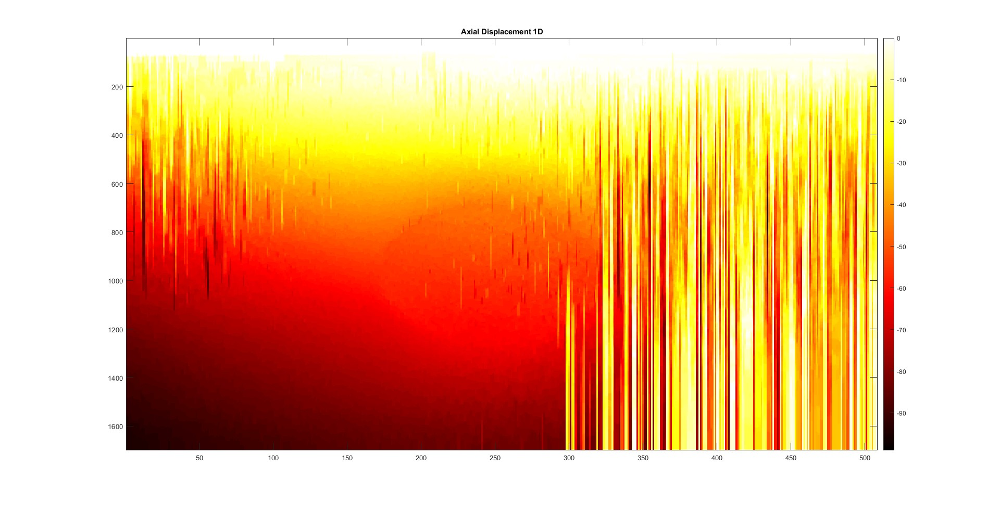
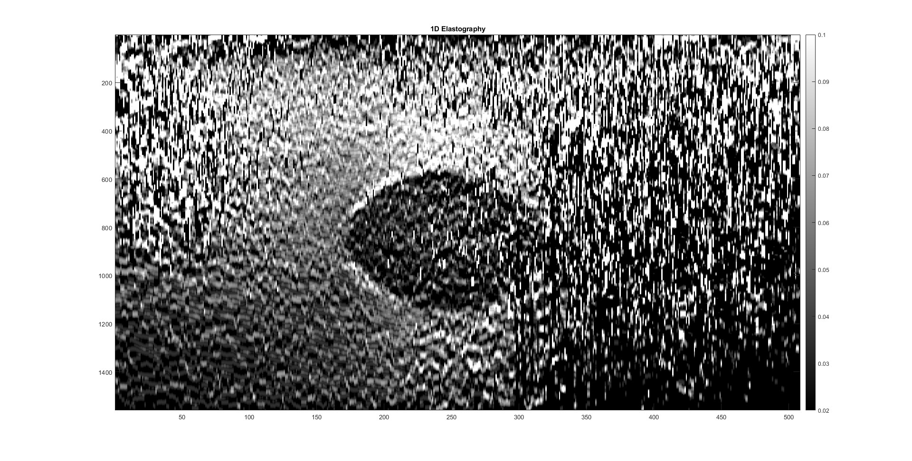
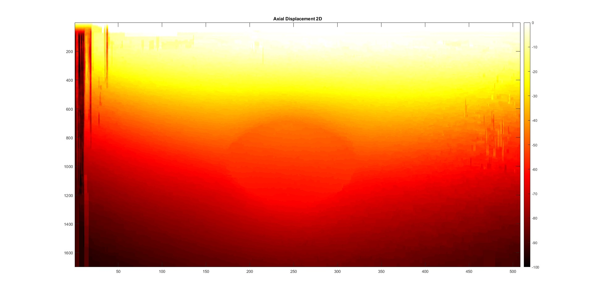
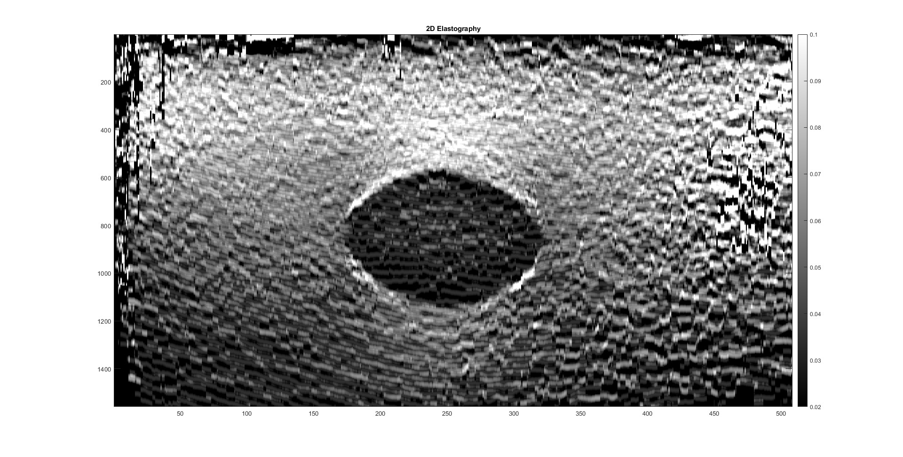

<h1 align="center">
  <i><font color="#4A7EBB">Ultrasound Elastography — A Dynamic Programming Approach</font></i>
</h1>

<p align="center">
  <b>MATLAB Implementation of</b><br>
  <b><a href="https://www.researchgate.net/publication/23280508">Ultrasound Elastography: A Dynamic Programming Approach</a> (Rivaz et al., IEEE TMI, 2008)</b><br>
</p>

## 📌 Overview

This repository is a MATLAB reimplementation of the seminal paper [*Ultrasound Elastography: A Dynamic Programming Approach*](https://www.researchgate.net/publication/23280508) by Rivaz et al. The project reproduces the 1-D and 2-D strain imaging algorithms based on dynamic programming for robust estimation of tissue displacement in ultrasound elastography.  

We further evaluated this method using real RF ultrasound data and analyzed its ability to detect tumors based on strain imaging with quantitative metrics including **Signal-to-Noise Ratio (SNR)** and **Contrast-to-Noise Ratio (CNR)**.


## 📖 Project Features

- ✅ 1D axial displacement estimation using dynamic programming  
- ✅ 2D displacement with lateral regularization for robustness  
- ✅ Strain map generation with LSQ estimation  
- ✅ Performance analysis via CNR and SNR metrics  
- ✅ Visualization tools for displacement and strain heatmaps 

## 📊 Results

### ▶ 1-D DP
<!-- <p align="center">
  
</p> -->

<p align="center">
  
  
  
</p>
<p align="center">
  <em>Figure 4: (Left) RF Data After Compression, (Center) 1D Displacement Map, (Right) Strain Image (Window = 43)</em>
</p>


### ▶ 2-D DP
<p align="center">
  
  
  
</p>
<p align="center">
  <em>Figure 4: (Left) RF Data After Compression, (Center) 2D Displacement Map, (Right) Strain Image (Window = 43)</em>
</p>

### 📈 Quantitative Evaluation

| 📊 Metric       | 🧮 1D DP (Raw) | 🧽 1D DP + Median Filter | 🧠 2D DP |
|----------------|---------------|---------------------------|----------|
| **SNR**        | 5.24          | 6.10                      | **8.71** |
| **CNR**        | 2.35          | 4.52                      | **7.61** |

> ✅ **Conclusion**: The 2D Dynamic Programming method significantly outperforms the 1D variants in both SNR and CNR, indicating clearer tumor boundaries and reduced noise.

## 🚀 Getting Started

### 📦 Prerequisites

- MATLAB R2021a or later
- Image Processing Toolbox
- Signal Processing Toolbox

### 🛠 Installation

1. Clone the repository:
   ```bash
   git clone https://github.com/sepehrgh98/Ultrasound-Elastography-A-Dynamic-Programming-Approach.git
   cd Ultrasound-Elastography-A-Dynamic-Programming-Approach
   ```
2. Open MATLAB and navigate to the project folder.
3. Run the 1D or 2D dynamic programming scripts:
    ```bash
    run('SourceCode/Main_1D.m');  % 1D Elastography
    run('SourceCode/Main_2D.m');  % 2D Elastography
    ```
4. Output images and plots will be saved in the **results/** folder.


## 🙏 Acknowledgments

This repository is a course project reimplementation of the paper by Rivaz et al. (2008) as part of the Medical Imaging course at Concordia University.

We thank the original authors for their pioneering work and the course instructors for providing RF ultrasound data and guidance.

Developed by:
- **Sepehr Ghamari**  
- **Shabnam Ghareh Mohamammadlou**  
- **Ala Keramati**

Special thanks to Prof. Rivaz for technical insights and support.


## 📬 Contact

If you have any questions or feedback, feel free to contact us at:

📧 se_gham@encs.concordia.ca 

📧 sepehrghamri@gmail.com
